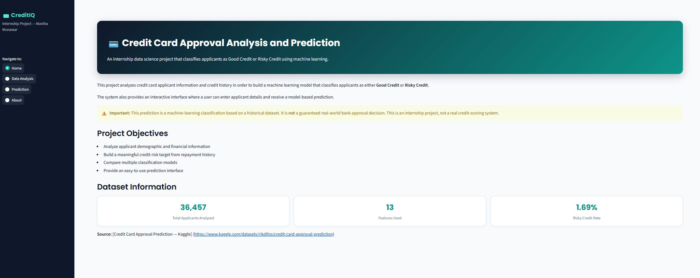
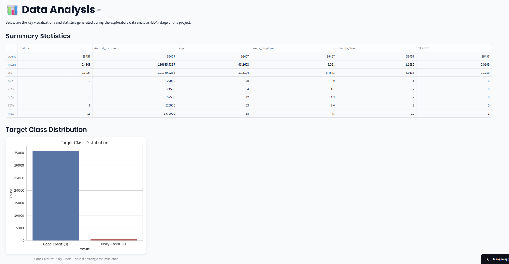
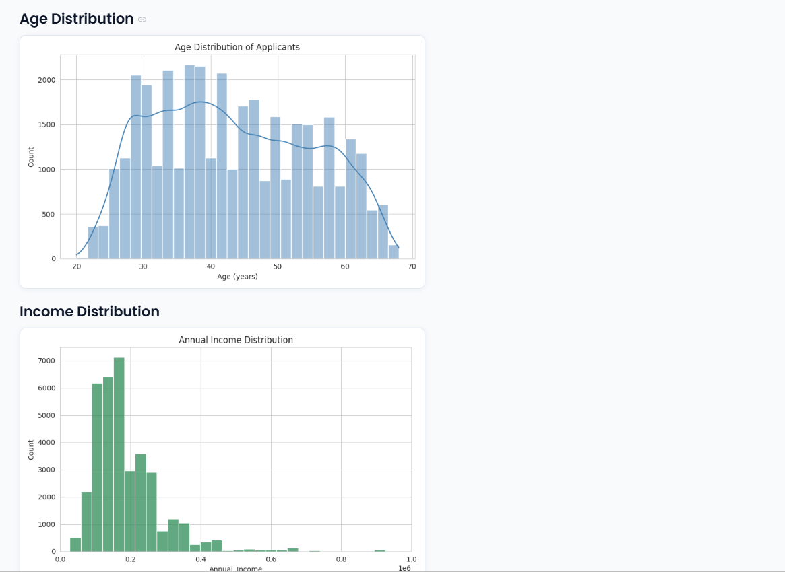
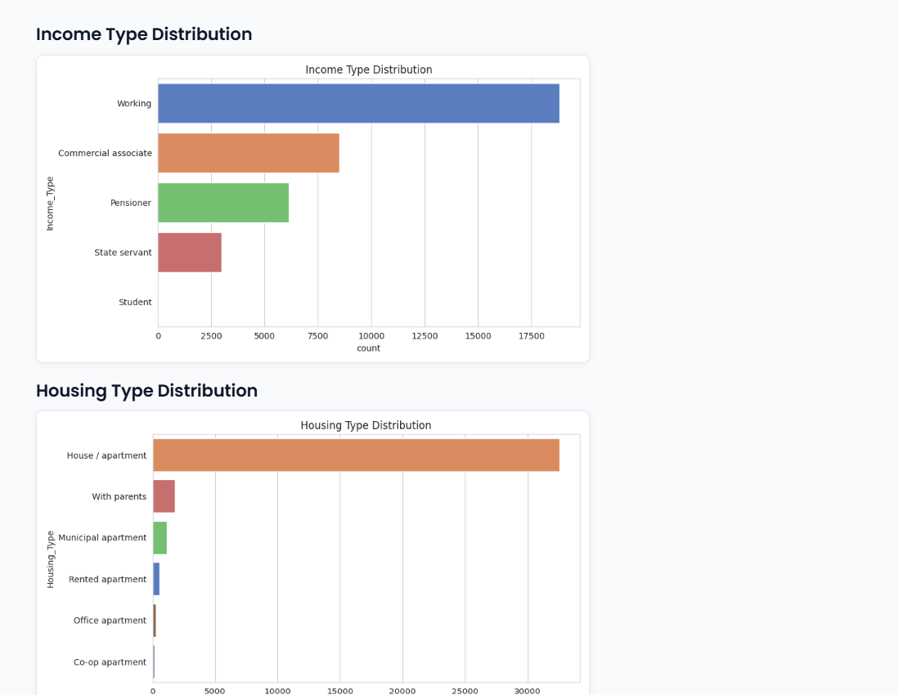
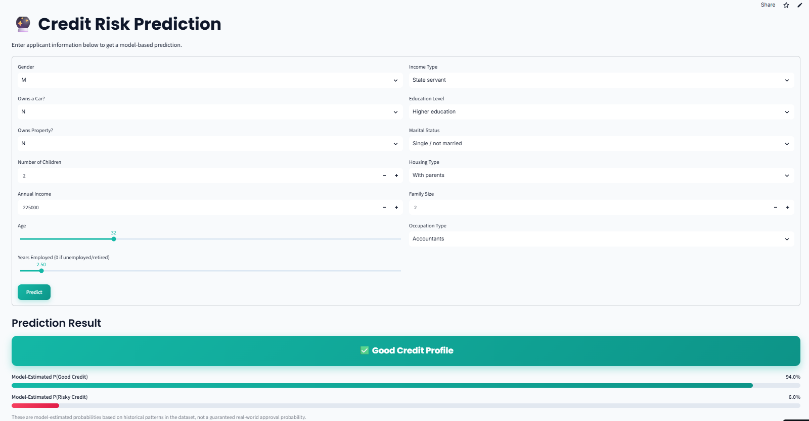
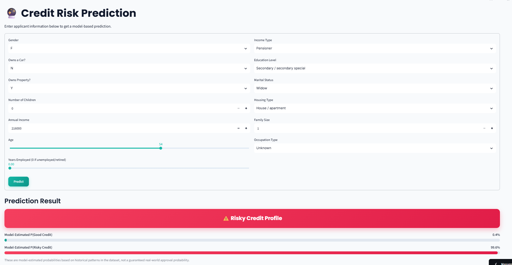
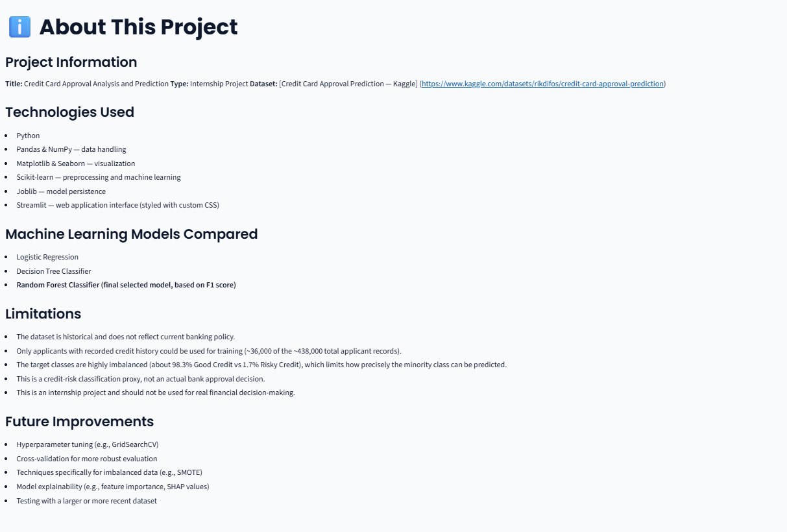

# Credit Card Approval Analysis and Prediction

**Live App:** https://credit-card-approval-analysis-prediction-xdwbrfcc99wgbi4hsyudt.streamlit.app/
**Type:** Internship Project
**Author:** Maniha Munawar

---

## 1. Project Overview

This project analyzes credit card applicant information and credit-history
records in order to classify applicants as either **Good Credit** or
**Risky Credit**, using machine learning. It includes a full data pipeline
(cleaning, merging, feature engineering, EDA, preprocessing, model
training and evaluation) and an interactive Streamlit web application
where a user can enter applicant details and receive a model-based
prediction.

**Important:** the source dataset does not provide a ready-made bank
"Approved/Rejected" label. Instead, this project builds a credit-risk
target from applicants' repayment history (explained in Section 3). This
project is therefore best understood as a **credit-risk classification
system**, used as a proxy for approval-worthiness — not a simulation of
any real bank's internal decision process, and not a guarantee of a real
banking outcome.

## 2. Objectives

- Analyze applicant demographic and financial data alongside credit
  repayment history
- Build a meaningful, reproducible credit-risk target from repayment
  history (since no ready-made label exists)
- Engineer a clean, understandable feature set
- Compare multiple classification models using metrics appropriate for
  imbalanced data
- Select a final model based on actual evaluation results
- Provide an accessible, interactive prediction interface

## 3. Dataset

**Name:** Credit Card Approval Prediction
**Source:** [Kaggle — rikdifos/credit-card-approval-prediction](https://www.kaggle.com/datasets/rikdifos/credit-card-approval-prediction)

The dataset consists of two files:

- **`application_record.csv`** — one row per applicant, with demographic
  and financial fields (gender, income, education, family status, housing
  type, employment info, etc.)
- **`credit_record.csv`** — one row per applicant *per month*, containing
  a `STATUS` column describing how overdue (if at all) that applicant's
  payment was that month.

**How the datasets are connected:** both files share an `ID` column. Since
`application_record.csv` had 47 duplicate `ID`s, those were dropped
(keeping the first occurrence) before merging. Of the two files, only
36,457 applicant `ID`s appear in both — an inner join was used, since a
target label can only be computed for applicants with recorded credit
history. The remaining ~402,000 applicants in `application_record.csv`
have no credit history and were therefore not usable for training.

**Target-generation method:** for each applicant `ID`, all of their
monthly `STATUS` records were checked. If the applicant was **ever** 60+
days overdue (`STATUS` 2, 3, 4, or 5) at any point in their history, they
were labeled **Risky Credit (1)**; otherwise **Good Credit (0)**. A 60-day
threshold is a standard, defensible cutoff in credit-risk analysis, and
this rule is simple, reproducible, and fully documented in the notebook.

**Resulting class balance (real, computed from the data):**

| Class | Count | Percentage |
|---|---|---|
| Good Credit (0) | 35,841 | 98.31% |
| Risky Credit (1) | 616 | 1.69% |

This is a **severe class imbalance**, which directly shaped the modeling
choices described in Sections 6 and 7.

## 4. Features

13 features were engineered from the raw columns:

| Feature | Description |
|---|---|
| Gender | Applicant's gender |
| Own_Car | Whether the applicant owns a car |
| Own_Realty | Whether the applicant owns property |
| Children | Number of children |
| Annual_Income | Applicant's total annual income |
| Income_Type | Source/type of income (e.g. Working, Pensioner) |
| Education | Highest education level |
| Marital_Status | Marital status |
| Housing_Type | Type of housing |
| Age | Derived from `DAYS_BIRTH` |
| Years_Employed | Derived from `DAYS_EMPLOYED`, with the dataset's unemployed/retired sentinel value corrected to 0 |
| Family_Size | Number of family members |
| Occupation_Type | Occupation category (missing values filled as "Unknown") |

## 5. Technologies Used

- **Python** — core language
- **Pandas / NumPy** — data loading, cleaning, transformation
- **Matplotlib / Seaborn** — exploratory visualizations
- **Scikit-learn** — preprocessing pipeline and classification models
- **Joblib** — saving/loading the trained pipeline
- **Streamlit** — interactive web application
- **Jupyter Notebook** — full analysis and model-building workflow
- **GitHub** — source control and hosting
- **Streamlit Community Cloud** — free live deployment

## 6. Project Workflow

```
Kaggle Dataset
   → Data Cleaning
   → Data Integration (merge on ID)
   → Target Creation (60+ day delinquency rule)
   → Feature Engineering
   → Exploratory Data Analysis
   → Preprocessing (ColumnTransformer: scaling + one-hot encoding)
   → Model Training (Logistic Regression, Decision Tree, Random Forest)
   → Model Evaluation (Accuracy, Precision, Recall, F1)
   → Final Model Selection (Random Forest, by F1 score)
   → Streamlit Application
   → GitHub Repository
   → Streamlit Community Cloud Deployment
   → Live URL
```

## 7. Installation

Clone the repository and install the pinned dependencies:

```bash
git clone https://github.com/ahmedbilalme/Credit-Card-Approval-Analysis-Prediction.git
cd Credit-Card-Approval-Analysis-Prediction
pip install -r requirements.txt
```

To reproduce the notebook from scratch, download `application_record.csv`
and `credit_record.csv` from the [Kaggle dataset page](https://www.kaggle.com/datasets/rikdifos/credit-card-approval-prediction)
and place them in the `data/` folder (see `data/README.md`).

## 8. Running the Application

```bash
streamlit run app.py
```

The app will open in your browser, or visit the live deployed version:
**https://credit-card-approval-analysis-prediction-xdwbrfcc99wgbi4hsyudt.streamlit.app/**

## 9. Usage

1. Open the app and use the sidebar to navigate between **Home**, **Data
   Analysis**, **Prediction**, and **About**.
2. On the **Prediction** page, fill in the applicant's details (gender,
   income, education, employment, etc.).
3. Click **Predict**.
4. The app displays a **Good Credit Profile** or **Risky Credit Profile**
   result, along with model-estimated probabilities for each class.

## 10. Exploratory Data Analysis

Key findings from the EDA (see the notebook for all 10 charts):

- **Target distribution:** heavily imbalanced — 98.31% Good Credit vs
  1.69% Risky Credit.
- **Age:** applicants are concentrated between roughly 28 and 45 years old.
- **Income vs target:** the analysis shows almost no difference in income
  between Good Credit and Risky Credit applicants — income alone does not
  strongly separate the two classes in this dataset.
- **Education vs target:** the analysis shows a mild association between
  lower education levels and a higher risky-credit rate (Lower Secondary:
  2.67% risky vs Academic Degree: 0%, though the latter group is small).
- **Employment vs target:** the analysis shows applicants with shorter
  employment history have some association with a higher risky-credit
  rate, though the distributions overlap considerably.

These are associations observed in the data, not causal claims.

## 11. Machine Learning Models

Three models were trained, each with `class_weight='balanced'` to address
the severe class imbalance:

- **Logistic Regression** — a linear baseline model
- **Decision Tree Classifier** — a simple, non-linear model
- **Random Forest Classifier** — an ensemble of decision trees

All three were wrapped in a single Scikit-learn `Pipeline` together with
the preprocessing step (`StandardScaler` for numeric features,
`OneHotEncoder` for categorical features), fitted only on the training
data to avoid data leakage.

## 12. Model Evaluation

Real results from the held-out 20% test set (7,292 applicants, stratified
to preserve the 98.3%/1.7% class ratio):

| Model | Accuracy | Precision | Recall | F1 Score |
|---|---|---|---|---|
| Logistic Regression | 0.599 | 0.021 | 0.496 | 0.040 |
| Decision Tree | 0.954 | 0.165 | 0.431 | 0.238 |
| **Random Forest** | **0.960** | **0.183** | 0.390 | **0.249** |

**Why not just accuracy?** With ~98% of applicants labeled Good Credit, a
model that always predicts "Good Credit" would score ~98% accuracy while
catching zero risky applicants. Precision, recall, and F1 on the minority
class are what actually show whether a model is doing useful work — this
is exactly why Logistic Regression's high-looking "accuracy" ceiling
doesn't apply, and why its real F1 (0.040) reveals it barely helps at all.

**Final model selected: Random Forest**, based on the highest F1 score —
the best balance of precision and recall on the minority class. This is
a real trade-off against Decision Tree's slightly higher recall (0.431 vs
0.390), and is stated here honestly rather than assuming Random Forest
would automatically win.

## 13. Testing

**Data testing:**

| Check | Result |
|---|---|
| Missing values (`OCCUPATION_TYPE`) | 134,203 (30.6%) — filled as "Unknown" |
| Duplicate `ID`s in application_record | 47 — dropped |
| Full duplicate rows | 0 in either file |
| `DAYS_EMPLOYED` sentinel value | 365243 (unemployed/retired) — corrected to 0 |
| Target class distribution | 98.31% Good / 1.69% Risky (confirmed) |

**Model testing:** see Section 12 — Accuracy, Precision, Recall, F1, and
confusion matrix computed for all three models on the real test set.

**Application testing:**

| Test Case | Description | Result | Status |
|---|---|---|---|
| 1 | Typical working applicant, mid income, 5 yrs employed | Good Credit (99.1% confidence) | Pass |
| 2 | All four pages load without errors | No exceptions | Pass |
| 3 | Prediction form submits and returns a result | Prediction + probabilities displayed | Pass |
| 4 | Model reload from disk (`joblib.load`) | Identical prediction to training-time output | Pass |
| 5 | Clean-environment dependency install (pinned versions) | No version-mismatch warnings | Pass |

## 14. Screenshots

**Home Page**


**Data Analysis — Summary Statistics & Target Distribution**


**Data Analysis — Age & Income Distribution**


**Data Analysis — Income Type & Housing Type Distribution**


**Prediction Form & Good Credit Result**


**Prediction Form & Risky Credit Result**


**About Page**


## 15. System Architecture

See Section 6 for the full workflow diagram. In short: raw CSVs → cleaned
and merged in the notebook → target and features engineered → three
models trained and compared → best model saved as a single Scikit-learn
Pipeline (`models/credit_card_model.pkl`) → loaded directly by `app.py`,
so the same preprocessing is guaranteed at prediction time.

## 16. Challenges

- **Missing values:** `OCCUPATION_TYPE` was missing for ~30% of
  applicants — resolved by adding an "Unknown" category rather than
  dropping a third of the data.
- **Sentinel values:** `DAYS_EMPLOYED` used 365243 as a placeholder for
  unemployed/retired applicants, which would have badly skewed the
  `Years_Employed` feature if left uncorrected.
- **Dataset integration:** only ~8% of `application_record.csv` applicants
  had matching credit history, requiring an inner join and a smaller
  final dataset (36,457 rows) than the raw applicant table (438,510 rows).
- **Target creation:** no ready-made approval label existed; a
  reproducible rule had to be defined and justified from the `STATUS`
  history.
- **Severe class imbalance:** only 616 of 36,457 applicants (1.69%) were
  Risky Credit, which limited how precisely the minority class could be
  learned and required `class_weight='balanced'`, stratified splitting,
  and F1-based model selection rather than accuracy.
- **Dependency versioning:** an unpinned `requirements.txt` initially
  caused the deployed model to load under a newer scikit-learn version
  than it was trained with, producing version-mismatch warnings — fixed
  by pinning exact package versions.

## 17. Future Improvements

- Hyperparameter tuning (e.g. `GridSearchCV`)
- Cross-validation for more robust performance estimates
- Dedicated imbalanced-data techniques (e.g. SMOTE)
- Model explainability (e.g. feature importance plots, SHAP values)
- Testing against a larger or more recent dataset

## 18. Limitations

- The dataset is historical and does not reflect current banking policy.
- The model was trained only on the ~36,457 applicants who had recorded
  credit history — the majority of applicants in the raw dataset could
  not be labeled and were excluded.
- Predictions are model-based estimates, not guaranteed real-world
  outcomes.
- This is an internship project and should not be used for real
  financial or lending decisions.

## 19. Conclusion

This project took raw, real-world-style applicant and credit-history data
through a complete data science workflow — cleaning, merging, reproducible
target creation, feature engineering, exploratory analysis, preprocessing,
model comparison, and deployment. Given the severe class imbalance in the
underlying data, a Random Forest classifier was selected as the final
model based on its F1 score, and deployed as an interactive Streamlit
application that gives users a transparent, clearly-labeled credit-risk
classification rather than a false guarantee of a real banking decision.

## 20. References

- Dataset: [Credit Card Approval Prediction — Kaggle](https://www.kaggle.com/datasets/rikdifos/credit-card-approval-prediction)
- [Pandas Documentation](https://pandas.pydata.org/docs/)
- [NumPy Documentation](https://numpy.org/doc/)
- [Matplotlib Documentation](https://matplotlib.org/stable/index.html)
- [Seaborn Documentation](https://seaborn.pydata.org/)
- [Scikit-learn Documentation](https://scikit-learn.org/stable/documentation.html)
- [Joblib Documentation](https://joblib.readthedocs.io/)
- [Streamlit Documentation](https://docs.streamlit.io/)
- [Streamlit Community Cloud Deployment Guide](https://docs.streamlit.io/deploy/streamlit-community-cloud)
